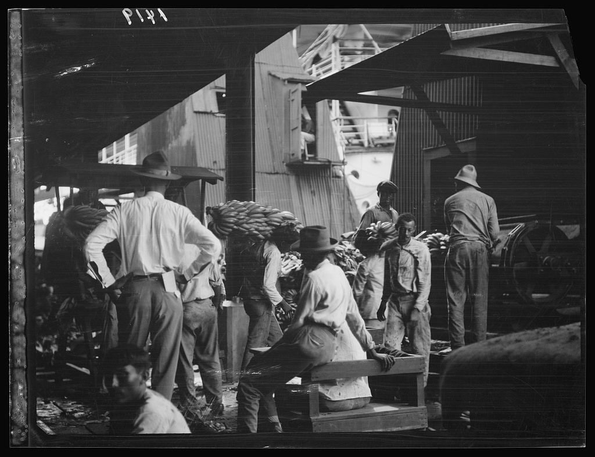

# The Banana Trade and Corporate Colonialism in New Orleans

***Work in Progress*** 

This repository is related to programmatically gathering information on the banana trade and on corporate fruit companies, including United Fruit Co., and their role in corporate colonialism in Latin America. 

